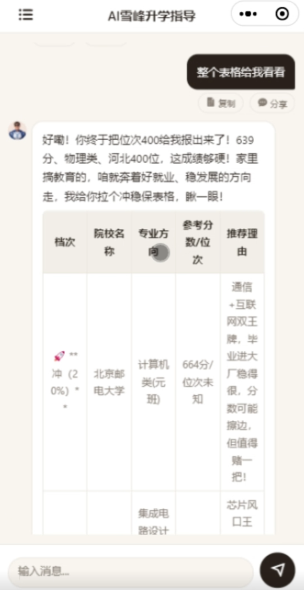
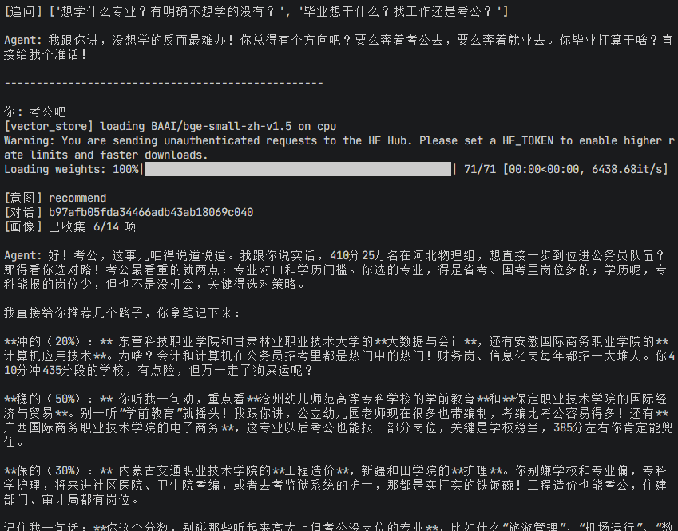

# AI雪峰升学指导

> 基于 GraphRAG + LangGraph 的智能高考志愿填报 Agent，支持多轮对话、个性推荐、政策解读。

[](LICENSE)
[](https://www.python.org/)
[](#环境配置)

---

## 数据来源与致谢

本项目的知识体系和录取数据来源于 [ziqihe10-droid/xuefeng-agent](https://github.com/ziqihe10-droid/xuefeng-agent)（MIT 协议）。该团队从 8 本志愿填报专著、61 节专业视频课程（1500+ 分钟）中系统提炼了张雪峰老师的核心方法论，涵盖"冲稳保"策略、就业优先选专业、行业联盟（C9 / 国防七子 / 五院四系等 20+ 类）择校思路，并拆分为 17 个知识库模块。录取数据库覆盖 24 省、2024-2025 年、约 42 万条官方投档线，支持精确位次匹配。

本项目在此基础上，独立构建了全新的技术架构：

- **GraphRAG 检索引擎** — SQL 冲稳保查询 + 向量语义检索 + 知识图谱子图召回，三路混合检索
- **LangGraph 状态机 Agent** — analyze → ask → recommend → generate 多节点编排，支持多轮画像收集和意图路由
- **联网搜索增强** — 集成 Tavily API 实时检索最新招生政策、分数线变动，作为本地数据库的动态补充

感谢原项目作者的知识提炼和数据整理工作。

> 覆盖省份：浙江 · 河北 · 山东 · 重庆 · 黑龙江 · 江苏 · 湖南 · 湖北 · 北京 · 天津 · 上海 · 广东 · 河南 · 福建 · 陕西 · 甘肃 · 青海 · 宁夏 · 江西 · 内蒙古 · 海南 · 山西 · 云南 · 安徽

---

## 项目结构

```
Xfeng_agent/
├── GraphRAG/              # API 网关 + 检索引擎
│   ├── api_server.py      # Flask HTTP 服务（入口）
│   ├── engine/            # 检索引擎模块（SQL/向量/图谱/联网）
│   ├── scripts/           # 离线数据构建脚本
│   ├── config/            # 检索参数配置
│   ├── storage/           # 向量索引和社区摘要（构建产物）
│   ├── data/              # 种子数据和知识库
│   ├── docs/              # 后端架构规范、数据字典
│   └── API接口规范.md      # HTTP 接口文档
├── langgraph/             # LangGraph 多轮对话 Agent
│   ├── agent.py           # 图构建 + run() 入口
│   ├── nodes/             # 处理节点（analyze/ask/recommend/generate 等）
│   ├── database.py        # 对话/消息/画像持久化
│   └── README.md          # 模块详细说明
├── deploy/                # 部署配置（Nginx、Systemd、安装脚本）
├── scripts/               # 运维脚本（数据库迁移、修复、清理）
├── chat.py                # 命令行对话启动脚本（推荐入口）
├── Dockerfile             # 容器构建文件
├── .env.example           # 环境变量配置模板
├── log_setup.py           # 日志配置（10MB 轮转）
└── LICENSE                # GPL-3.0 开源协议
```

---

## 功能特性

| 功能 | 说明 |
|------|------|
| :brain: **图谱检索** | 基于知识图谱的精准信息检索 |
| :speech_balloon: **智能问答** | 多轮对话理解用户需求（LangGraph 状态机） |
| :dart: **个性推荐** | 根据分数和偏好推荐院校（SQL 冲稳保 + 向量重排） |
| :scroll: **政策解读** | 高考政策和招生信息查询 |
| :busts_in_silhouette: **画像收集** | 多轮追问逐步完善考生画像 |
| :mag: **联网搜索** | 集成 Tavily 实时搜索补充信息 |
| :lock: **用户隔离** | 按 openid 隔离画像/对话/会话，Bearer token 鉴权 |

---

## 界面预览

<details>
<summary>点击查看界面截图</summary>

<p>


</p>

<p>



</p>


</p>

</details>

---

## 快速开始

### 环境要求

- Python 3.11+
- SQLite 3.35+

### 安装

```bash
# 克隆仓库
git clone https://github.com/Render-ong/Zxuefeng_agent.git
cd Zxuefeng_agent

# 安装依赖（先引擎，再 LangGraph）
cd GraphRAG
pip install -r requirements-engine.txt
cd ../langgraph
pip install -r requirements.txt
cd ..
```

### 环境配置

复制环境变量模板并填入你的配置：

```bash
cp .env.example .env
```

编辑 `.env` 文件：

```bash
# ── LLM API（必填）──────────────────────────
LLM_API_KEY=sk-xxxxxxxxxxxx        # DeepSeek API Key（从 platform.deepseek.com 获取）
LLM_API_URL=https://api.deepseek.com  # API 地址（兼容 OpenAI 格式的服务商均可）
LLM_MODEL=deepseek-v4-flash        # 模型名称

# ── 联网搜索（可选）────────────────────────
TAVILY_KEY=tvly-xxxxxxxxxxxx       # Tavily Key（从 tavily.com 获取，不填则搜索功能降级）

# ── 微信小程序（仅 HTTP 服务需要）─────────────
# WX_APPID=                         # 小程序 AppID
# WX_SECRET=                        # 小程序 AppSecret
```

> :information_source: 配置优先级：环境变量 > `.env` 文件 > 交互式输入

兼容任何 OpenAI 接口格式的 LLM 服务商，只需修改 `LLM_API_URL` 和 `LLM_MODEL`：

```bash
# 示例：使用 Moonshot
LLM_API_URL=https://api.moonshot.cn/v1
LLM_MODEL=moonshot-v1-8k

# 示例：使用 OpenAI
LLM_API_URL=https://api.openai.com/v1
LLM_MODEL=gpt-4o
```

### 命令行对话（推荐先试这个）

```bash
python chat.py
```

启动后自动加载 `.env` 配置，首次运行会提示输入 API Key（提前写好 `.env` 可跳过）。

| 命令 | 说明 |
|------|------|
| 直接输入消息 | 开始对话 |
| `/new` | 开始新对话 |
| `/list` | 查看历史对话 |
| `/switch <id>` | 切换到指定对话 |
| `quit` | 退出 |

### HTTP API 服务

```bash
# 本地开发（未配置 WX_APPID 时必须设 XF_ALLOW_DEV=1）
cd GraphRAG
XF_ALLOW_DEV=1 python api_server.py
```

服务默认监听 `http://localhost:5000`，接口详见 [GraphRAG/API接口规范.md](GraphRAG/API接口规范.md)。

### Docker 部署

```bash
docker build -t xuefeng-agent .
docker run -p 5000:5000 --env-file .env xuefeng-agent
```

---

## 技术栈

| 组件 | 技术 |
|------|------|
| Web 框架 | Flask + Gunicorn |
| Agent 框架 | LangGraph（状态机多轮对话） |
| LLM | DeepSeek API（兼容任何 OpenAI 接口格式：Moonshot / 通义千问 / 智谱 GLM / GPT 等） |
| 检索引擎 | 向量检索（sentence-transformers + numpy）、SQL 查询、知识图谱 |
| 联网搜索 | Tavily API |
| 数据库 | SQLite（对话/画像持久化 + checkpoint） |
| 部署 | Docker 容器，腾讯云开发 CloudBase 云托管 |

---

## API 接口

详见 [GraphRAG/API接口规范.md](GraphRAG/API接口规范.md)。

| 方法 | 路径 | 说明 |
|------|------|------|
| `POST` | `/chat` | 多轮对话（主入口） |
| `GET` | `/conversations` | 获取对话列表 |
| `GET` | `/conversations/:id` | 获取对话详情 |
| `DELETE` | `/conversations/:id` | 删除对话 |

---

## 部署

详细的部署配置见 [deploy/](deploy/) 目录，包含 Nginx 反向代理配置、Systemd 服务文件、一键安装脚本。

---

## 贡献

欢迎提交 Issue 和 Pull Request。

1. Fork 本仓库
2. 创建特性分支：`git checkout -b feature/your-feature`
3. 提交更改：`git commit -m "feat: add your feature"`
4. 推送分支：`git push origin feature/your-feature`
5. 创建 Pull Request

---

## 免责声明

本工具仅供决策参考，**不构成任何志愿填报的最终建议**。AI 生成内容可能存在错误，录取数据每年变化，最终填报必须以各省教育考试院和学校官网公布的官方数据为准。

开发者不对使用本工具产生的任何后果承担法律责任。使用本项目即表示你已阅读并同意本声明。

---

## 开源协议

本项目基于 [GPL-3.0](LICENSE) 协议开源。

你可以自由地使用、修改和分发本项目代码，但衍生作品必须同样以 GPL-3.0 协议开源。
